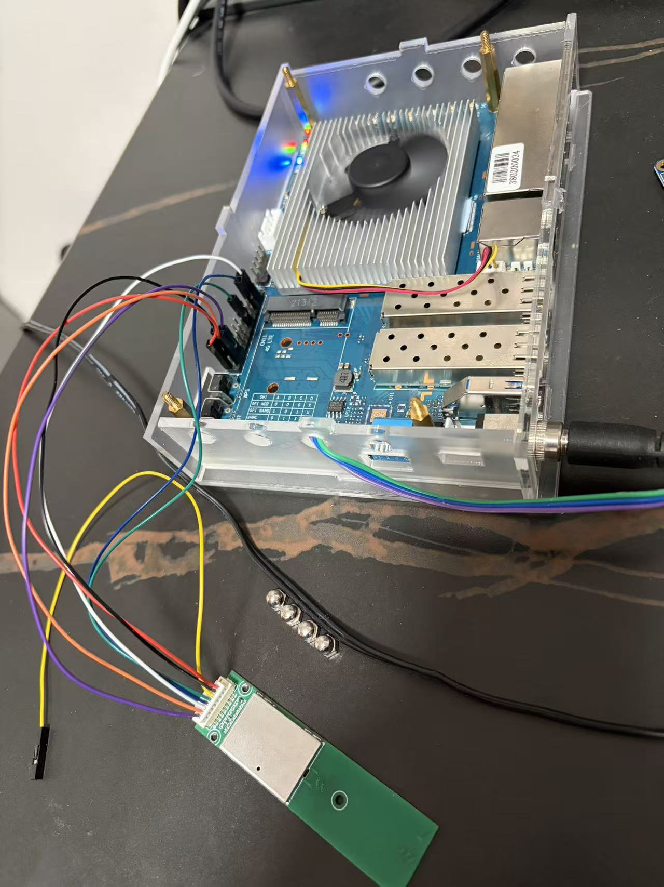
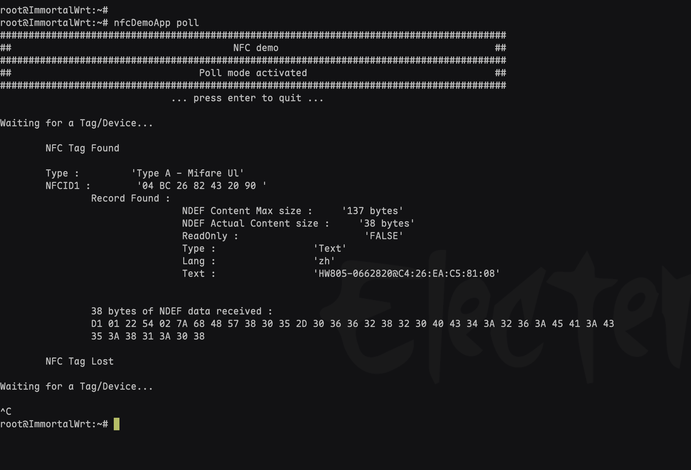

# OpenWrt Package: libnfc-nci

OpenWrt package for NXP PN7160 NFC Controller NCI stack.

NOTE: do not download the firmware, because download bugy

now software support version:

FW Version: 12.50.5 (in module)

FW Version: 12.50.9 (in libpn7160_fw.so)


## 🔍 PN7160 Special Characteristics

### Why doesn't i2cdetect scan detect it?

According to NXP official documentation, PN7160 will not respond to standard I2C scans. Here's why:

**PN7160 Special Features:**
- Uses proprietary NCI (NFC Controller Interface) protocol
- Not a standard I2C slave device
- Only responds to specific NCI command sequences
- Does not respond to regular I2C read operations
- Requires specific initialization handshake process

**Correct Usage:**
- Must send correct NCI initialization commands
- Use NXP provided libraries and drivers
- Similar chips (like PN532, PN7150) have the same characteristics
- All require specialized drivers

### 🛠️ Using NXP Official Drivers and Libraries (Recommended Method)

```bash
# 1. Get NXP's NCI stack
git clone https://github.com/NXPNFCLinux/linux_libnfc-nci.git

# 2. Compile and install
cd linux_libnfc-nci
./bootstrap
./configure
make
sudo make install

# 3. Configure device tree or kernel driver
# PN7160 support needs to be enabled in Linux kernel
```

---

## 📦 Package Structure

```
libnfc-nci/
├── Makefile              # OpenWrt package definition
├── README.md             # This file (English)
├── README_CN.md          # Chinese documentation
├── patches/              # Source code patches
│   ├── 001-change-config-dir.patch
│   ├── 002-fix-transport-config-path.patch
│   ├── 003-fix-config-path-provider.patch
│   └── 100-64bit-support.patch
├── files/                # Additional files to install
└── src/                  # (Reserved for local source if needed)
```

---

## 🔧 Patches Description

### Configuration Path Patches (001-003)

These patches change the configuration file location from `/usr/local/etc/` to `/etc/nfc/`:

| Patch File | Description |
|------------|-------------|
| **001-change-config-dir.patch** | Updates `Makefile.am` to install configs to `/etc/nfc/` |
| **002-fix-transport-config-path.patch** | Updates `config.cc` transport path |
| **003-fix-config-path-provider.patch** | Updates all config paths in `ConfigPathProvider.cc` |

### 64-bit Support Patch (100)

**100-64bit-support.patch**: Fixes for 64-bit architecture compatibility
- Type conversion fixes (`unsigned int` vs `size_t`)
- Pointer dereference fixes
- Data structure alignment fixes

---

## ⚙️ Configuration Files

The package installs configuration files to `/etc/nfc/`:

**Main Configuration Files:**
- `libnfc-nci.conf` - System configuration
- `libnfc-nxp.conf` - Vendor configuration

**Additional Configuration Files** (if present):
- `libese-nxp.conf` - ESE configuration
- `libnfc-nxp_RF.conf` - RF configuration
- `libnfc-nxpTransit.conf` - Transit configuration

---

## 📦 Build Packages

This package produces three packages:

### 1. libnfc-nci - Main library
- `/usr/lib/libnfc_nci_linux.so*`
- `/etc/nfc/libnfc-nci.conf`
- `/etc/nfc/libnfc-nxp.conf`

### 2. libnfc-nci-utils - Utilities
- `/usr/sbin/nfcDemoApp`

### 3. libpn7160-fw - Firmware library
- `/usr/lib/libpn7160_fw.so*`

---

## 📋 Dependencies

### Runtime Dependencies
| Library | Description |
|---------|-------------|
| `libstdcpp` | C++ standard library |
| `libpthread` | POSIX threads |
| `librt` | Real-time extensions |
| `libgpiod` | GPIO library (for PN7160 hardware control) |

### Build Dependencies
- `autoconf`
- `automake`
- `libtool`

---

## 🚀 Installation

### 1. Add to OpenWrt Build System

Copy this directory to your OpenWrt packages feed:

```bash
# For feeds/packages
cp -r libnfc-nci $(OPENWRT_DIR)/feeds/packages/libs/

# Or for custom packages
cp -r libnfc-nci $(OPENWRT_DIR)/package/
```

### 2. Update Feeds (if using feeds)

```bash
cd $(OPENWRT_DIR)
./scripts/feeds update -a
./scripts/feeds install -a
```

### 3. Configure Package

```bash
make menuconfig
```

Navigate to:
- `Libraries` → Select `libnfc-nci`
- `Utilities` → Select `libnfc-nci-utils`
- `Libraries` → Select `libpn7160-fw`

### 4. Build Package

```bash
# Build single package
make package/libnfc-nci/compile V=s

# Build with dependencies
make package/libnfc-nci/{clean,compile} V=s

# Build all selected packages
make -j$(nproc)
```

### 5. Find Built Packages

```bash
ls $(OPENWRT_DIR)/bin/packages/*/packages/libnfc-nci*.ipk
```

---

## 🔌 Hardware Setup

### BPI-R3 26-Pin GPIO Header Pinout

| Sparefunction | Mainfunction | pin# |     | pin# | Mainfunction | Sparefunction |
|---------------|--------------|------|-----|------|--------------|---------------|
| -             | 3V3          | 1    | ● ● | 2    | 5V           | -             |
| I2C_SDA       | GPIO 4       | 3    | ● ● | 4    | 5V           | -             |
| I2C SCL       | GPIO 3       | 5    | ● ● | 6    | GND          | -             |
| PWM1          | GPIO 22      | 7    | ● ● | 8    | GPIO 43      | UART1 TX      |
| -             | GND          | 9    | ● ● | 10   | GPIO 42      | UART1 RX      |
| UART2 TX      | GPIO 30      | 11   | ● ● | 12   | GPIO 64      | PCM_CLK       |
| UART2 RX      | GPIO 29      | 13   | ● ● | 14   | GND          | -             |
| PCM_FS        | GPIO 65      | 15   | ● ● | 16   | GPIO 45      | UART1_RTS     |
| -             | 3V3          | 17   | ● ● | 18   | GPIO 44      | UART1_CTS     |
| SPIC_MO       | GPIO 7       | 19   | ● ● | 20   | GND          | -             |
| SPIC_MI       | GPIO 8       | 21   | ● ● | 22   | GPIO 62      | PCM_DTX       |
| SPIC_CK       | GPIO 6       | 23   | ● ● | 24   | GPIO 14      | SPIC_CS       |
| -             | GND          | 25   | ● ● | 26   | GPIO 63      | PCM_DRX       |

### PN7160 Module Pinout (B26-I-6818)

| PIN  | Signal | I/O Type | Description |
|------|--------|----------|-------------|
| PIN1 | SCL    | OD       | I2C SCL (internal 4.7K pull-up) |
| PIN2 | SDA    | OD       | I2C SDA (internal 4.7K pull-up) |
| PIN3 | IRQ    | I/O      | Tell the host this module have I2C data to send. High enable, normal Low |
| PIN4 | VEN    | I/O      | Reset the module, set Low to reset |
| PIN5 | D-/DWL | I/O      | USB D- (USB mode); DWL (I2C mode - firmware download) |
| PIN6 | D+/NC  | I/O      | USB D+ (USB mode); NC (I2C mode - not connected) |
| PIN7 | GND    | PWR      | Power GND |
| PIN8 | VDD    | PWR      | Power supply, default 5V (3.3V selectable) |

**Notes:**
- ① Module has internal 4.7KΩ pull-up resistors on I2C lines
- ② USB D+/D- pins for USB communication mode
- ③ In I2C mode: PIN5 = DWL (firmware download), PIN6 = NC (not connected)

### PN7160 to BPI-R3 Connection

| BPI-R3 Pin           | PN7160 Pin | Function   |
|----------------------|------------|------------|
| Pin 2 (5V)           | VDD (PIN8) | Power      |
| Pin 6 (GND)          | GND (PIN7) | Ground     |
| Pin 3 (GPIO 4/SDA)   | SDA (PIN2) | I2C Data   |
| Pin 5 (GPIO 3/SCL)   | SCL (PIN1) | I2C Clock  |
| Pin 23 (GPIO 6)      | IRQ (PIN3) | Interrupt  |
| Pin 21 (GPIO 8)      | VEN (PIN4) | Enable     |
| Pin 15 (GPIO 65)     | DWL (PIN5) | Download   |

**Connection Summary:**
- **Power & Ground**: Pin 2 (5V) and Pin 6 (GND - near 5V)
- **I2C Bus**: Pin 3 (SDA) and Pin 5 (SCL) → Hardware I2C (i2c-0)
- **Control Signals**: Pin 23 (IRQ), Pin 21 (VEN), Pin 15 (DWL)

### Enable I2C Interface

Add to `/etc/config/modules` or load manually:
```bash
insmod i2c-dev
```

---

## 💻 Usage

### Hardware Connection Example


*PN7160 module connected to BPI-R3 via 26-pin header*

### Basic NFC Operations

```bash
# Run demo application
nfcDemoApp poll

# Check configuration files
cat /etc/nfc/libnfc-nci.conf
cat /etc/nfc/libnfc-nxp.conf
```

### Configuration Files

The package includes multiple configuration files:

- **[libnfc-nxp.conf](files/libnfc-nxp.conf)** - Main NXP vendor configuration
- **[libnfc-nxp-debug.conf](files/libnfc-nxp-debug.conf)** - Debug configuration with verbose logging
- **[libnfc-nci.conf](files/libnfc-nci.conf)** - System configuration

### Test Results


*Successful NFC tag detection and reading*

### Configuration Override

You can override config paths using environment variables:
```bash
export LIBNFC_NCI_CONF_PATH=/custom/path/
```

---

## ⚠️ Important Notes

### 1. I2C Detection
PN7160 will NOT respond to standard I2C scan (`i2cdetect -y 1`). This is normal behavior as the device requires GPIO initialization first.

### 2. GPIO Library
Ensure `libgpiod` is installed. Required for modern kernels (6.6+).

### 3. Permission Requirements
The application needs access to:
- I2C device (`/dev/i2c-*`)
- GPIO devices
- Configuration files in `/etc/nfc/`

### 4. Kernel Requirements
- **Kernels < 6.6**: Legacy GPIO sysfs interface
- **Kernels >= 6.6**: libgpiod required

---

## 🛠️ Troubleshooting

### ❌ Problem: "nfcservice init fail"

**Solutions:**
- ✓ Verify GPIO pins are correctly configured
- ✓ Ensure `libgpiod` is installed
- ✓ Check I2C interface is enabled
- ✓ Verify hardware connections
- ✓ Check dmesg for kernel messages

### ❌ Problem: Configuration file not found

**Solutions:**
- ✓ Verify files exist in `/etc/nfc/`
- ✓ Check file permissions
- ✓ Review application logs for path details

### ❌ Problem: Build fails

**Solutions:**
- ✓ Ensure all dependencies are selected in menuconfig
- ✓ Clean build: `make package/libnfc-nci/clean`
- ✓ Check build log: `make package/libnfc-nci/compile V=s`

---

## 👨‍💻 Development

### Adding Custom Patches

1. Create patch file in `patches/` directory
2. Name format: `NNN-description.patch`
   - `000-099` → Configuration patches
   - `100-199` → Architecture/platform patches
   - `200-299` → Feature patches
   - `900-999` → Local/temporary patches
3. Patches are applied in numerical order

### Testing Changes

```bash
# Clean and rebuild
make package/libnfc-nci/clean
make package/libnfc-nci/compile V=s

# Test on device
scp bin/packages/*/packages/libnfc-nci*.ipk root@device:/tmp/
ssh root@device "opkg install /tmp/libnfc-nci*.ipk"
```

---

## 📄 License

BSD-3-Clause

---

## 📚 References

### Official Documentation
- 🔗 [NXP Official Repository](https://github.com/NXPNFCLinux/linux_libnfc-nci)
- 🔗 [NXP Community Porting Guide - Raspberry Pi 5](https://community.nxp.com/t5/NFC-Knowledge-Base/Porting-PN7160-NCI2-stack-to-Raspberry-Pi-5-OS-Bookworm/ta-p/1977521)
- 🔗 [PN7160 Linux Porting Guide (AN13287)](https://www.nxp.com/docs/en/application-note/AN13287.pdf)
- 🔗 [PN7160 Evaluation Kit Quick Start Guide (AN12991)](https://www.nxp.com/docs/en/application-note/AN12991.pdf)

### Community Resources
- 🔗 [OM27160 Raspberry I2C Troubleshooting](https://community.nxp.com/t5/NFC/OM27160-raspberry-i2c-NfcService-Init-Failed/m-p/1825250/thread-id/11431#M11473)
- 🔗 [Elechouse PN7160 Module](https://www.elechouse.com/product/pn7160-nfc-rfid-module/)
- 🔗 [Elechouse I2C Quick Guide](https://www.elechouse.com/wp-content/uploads/2024/06/Quick-Guide-I2C.pdf)

### OpenWrt Related
- 🔗 [OpenWrt Package Guidelines](https://openwrt.org/docs/guide-developer/packages)

### PN7160 Module Purchase
- 🔗 [B26-I-6818 Module (1688.com)](https://detail.1688.com/offer/849189785380.html?spm=a261y.25179003.relatedOffer.5.69cf47983rNrHB)

### PN7160 firmware download issue
- 🔗 [Remove libpn7160_fw.so, we need not download the firmware](https://community.nxp.com/t5/Other-NXP-Products/PN7160-NFC-bring-up-on-Yocto-Mickledore/m-p/2050086)
---

## 💬 Support

For issues related to:

| Issue Type | Get Help |
|------------|----------|
| 🔨 **Package building** | Check OpenWrt forums |
| 📡 **NFC functionality** | Refer to NXP documentation |
| 🔧 **PN7160 hardware** | Check NXP community forums |
